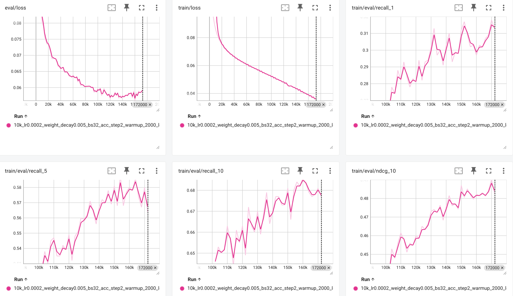

# llm-internalization

This repository contains the official implementation of:

**When Machines Speak: A Unified Generative Framework for Integrating Machine-Native Symbols into Pretrained Large Language Models** ([Yan et al., 2026](https://example.com))

# Setup environment

This repository uses both JAX and PyTorch. To avoid dependency conflicts, we recommend creating separate environments for each.

Run the following scripts to set up the environments:
```bash
$ bash setup/setup_torch.sh
$ bash setup/setup_jax.sh
```

# Run experiments

1. Create a folder named `workspace` to store data and model outputs.
2. Download datasets used in the paper and put them under `workspace/data`: 
    - [Amazon Beauty](https://cseweb.ucsd.edu/~jmcauley/datasets/amazon/links.html)
    - [LePaRD 10K, 20K, 50K](https://huggingface.co/datasets/rmahari/LePaRD/tree/main):   We only need the `top_xxxx_data.csv` files. 
    - [MovieLens 20M](https://grouplens.org/datasets/movielens/20m/)
    - [MovieLens 1M](https://grouplens.org/datasets/movielens/1m/)

    After extracting all files, the `workspace/data` directory should have the following structure:

    
2. Update `LLM_INTERNALIZATION/config.py` by setting the following parameters:
    ```python
    DATA_SOURCE
    REVIEW_TYPE
    os.environ["PROJECT_WORKSPACE"]   # path to the `workspace` directory
    ```
3. Experiments across datasets follow a similar workflow. Below is an example using **Amazon Beauty**.
    - Navigate to the dataset folder:

        ```bash
        cd LLM_INTERNALIZATION/amazon
        ```
    - Process data (generate semantic IDs, learn machine token groundings, and create data splits):
        ```
        bash f0_process_data.sh
        ```
    - Train the model and evaluate on the validation split:
        ```
        bash f1_train_think_multiple_GPU.sh
        ```
    - Evaluate on the test split using a selected checkpoint:
        ```
        bash f2_eval_sft_think_checkpoint.sh 0 <checkpoint_number>
        ```
    - For example, if checkpoint 128000 performs best on the validation set:
        ```
        bash f2_eval_sft_think_checkpoint.sh 0 128000
        ```


You can monitor training progress, including intermediate and final models, using TensorBoard. Training logs are stored in `workspace/runs/`. The following shows the training progress for LePaRD 10k dataset



All intermediate data, models, and final checkpoints are available at [HuggingFace llm_internalization](https://huggingface.co/datasets/UsernameAlreadyExitsts/llm_internalization).


# Reference
Please cite the following paper if you use llm-internalization in your work.
```
@inproceedings{
    title = "",
    author = "Su Yan, Rakesh Iyer",
    year = "2026",
}
```

<!-- Results of shared models

Beauty:
{'recall_1': 0.01819970486965076, 'eval/ndcg_1': 0.01819970486965076, 'recall_5': 0.0430622009569378, 'eval/ndcg_5': 0.03089844769674196, 'recall_10': 0.06220095693779904, 'eval/ndcg_10': 0.037058556984129104}
Lepard 10k:
{'recall_1': 0.28868253494263724, 'eval/ndcg_1': 0.28868253494263724, 'recall_5': 0.5735601514261219, 'eval/ndcg_5': 0.4392307353367373, 'recall_10': 0.6799341122980744, 'eval/ndcg_10': 0.47380910795573644}
Lepard 20k: 274000
{'recall_1': 0.2416170642283543, 'eval/ndcg_1': 0.2416170642283543, 'recall_5': 0.5058261218067657, 'eval/ndcg_5': 0.38064208114057924, 'recall_10': 0.6104068636910152, 'eval/ndcg_10': 0.4145900811279312}
 Lepard 50K:
 {'recall_1': 0.1780617936143792, 'eval/ndcg_1': 0.1780617936143792, 'recall_5': 0.4067360511859912, 'eval/ndcg_5': 0.2969017623460871, 'recall_10': 0.519015848294151, 'eval/ndcg_10': 0.33324522581670774}
ML 1m:
{'recall_1': 0.05364238410596026, 'eval/ndcg_1': 0.05364238410596026, 'recall_5': 0.16390728476821192, 'eval/ndcg_5': 0.10918143002409625, 'recall_10': 0.24056291390728476, 'eval/ndcg_10': 0.13376790988913193}
ML 20m: 200000
{'recall_1': 0.08240127659881727, 'eval/ndcg_1': 0.08240127659881727, 'recall_5': 0.19142483735640067, 'eval/ndcg_5': 0.13827380736766573, 'recall_10': 0.2604391557696057, 'eval/ndcg_10': 0.16050630525012022}

-->