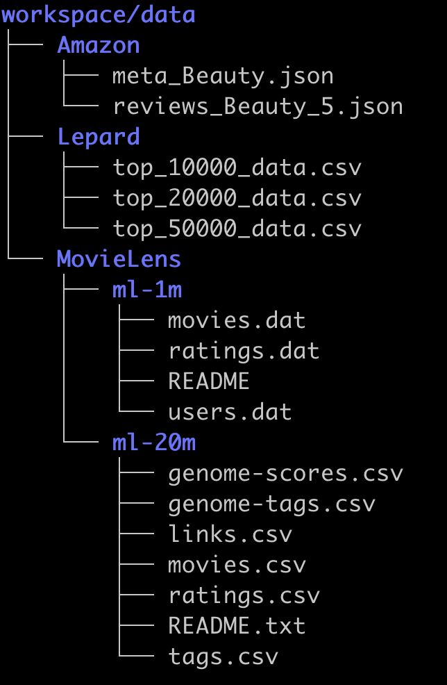

# llm-internalization

This repository contains the official implementation of:

**When Machines Speak: A Unified Generative Framework for Integrating Machine-Native Symbols into Pretrained Large Language Models** ([Yan et al., 2026](https://example.com))

# Setup environment

This repository uses both JAX and PyTorch. To avoid dependency conflicts, we recommend creating separate environments for each.

Run the following scripts to set up the environments:
```bash
$ bash setup/setup_torch.sh
$ bash setup/setup_jax.sh
```

# Run experiments

1. Create a folder named `workspace` to store data and model outputs.
2. Download datasets used in the paper and put them under `workspace/data`: 
    - [Amazon Beauty](https://cseweb.ucsd.edu/~jmcauley/datasets/amazon/links.html)
    - [LePaRD 10K, 20K, 50K](https://huggingface.co/datasets/rmahari/LePaRD/tree/main):   We only need the `top_xxxx_data.csv` files. 
    - [MovieLens 20M](https://grouplens.org/datasets/movielens/20m/)
    - [MovieLens 1M](https://grouplens.org/datasets/movielens/1m/)

    After extracting all files, the `workspace/data` directory should have the following structure:

    
2. Update `LLM_INTERNALIZATION/config.py` by setting the following parameters:
    ```python
    DATA_SOURCE
    REVIEW_TYPE
    os.environ["PROJECT_WORKSPACE"]   # path to the `workspace` directory
    ```
3. Experiments across datasets follow a similar workflow. Below is an example using **Amazon Beauty**.
    - Navigate to the dataset folder:

        ```bash
        cd LLM_INTERNALIZATION/amazon
        ```
    - Process data (generate semantic IDs, learn machine token groundings, and create data splits):
        ```
        bash f0_process_data.sh
        ```
    - Train the model and evaluate on the validation split:
        ```
        bash f1_train_think_multiple_GPU.sh
        ```
    - Evaluate on the test split using a selected checkpoint:
        ```
        bash f2_eval_sft_think_checkpoint.sh 0 <checkpoint_number>
        ```
    - For example, if checkpoint 128000 performs best on the validation set:
        ```
        bash f2_eval_sft_think_checkpoint.sh 0 128000
        ```


You can monitor training progress, including intermediate and final models, using TensorBoard. Training logs are stored in `workspace/runs/`.

All intermediate data, models, and final checkpoints are available at [HuggingFace llm_internalization](https://huggingface.co/datasets/UsernameAlreadyExitsts/llm_internalization).


# Reference
Please cite the following paper if you use llm-internalization in your work.
```
@inproceedings{
    title = "",
    author = "Su Yan, Rakesh Iyer",
    year = "2026",
}
```